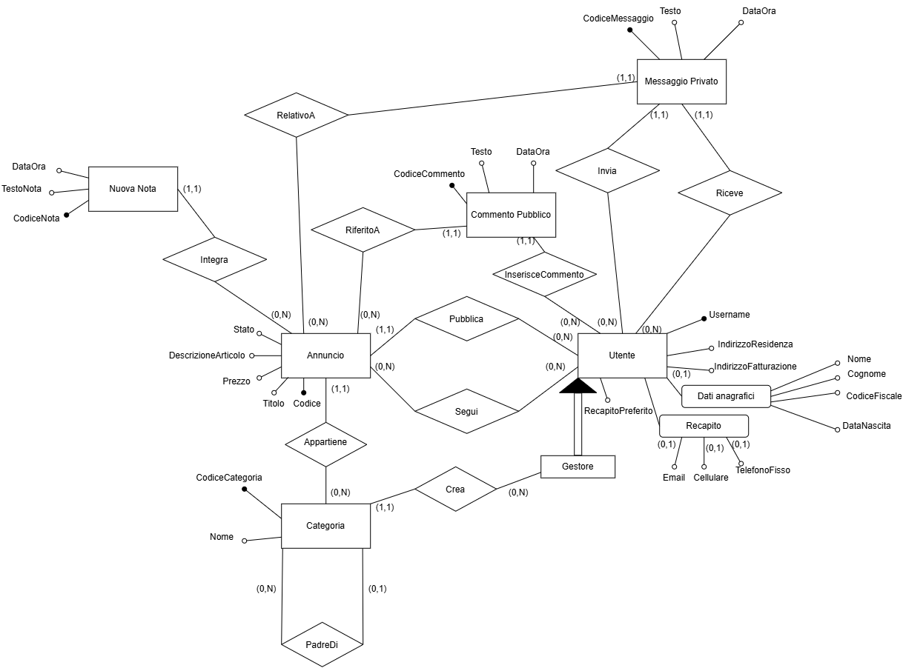

# 🗄️ Bacheca elettronica di annunci

**Relational database design and implementation with MySQL.** Academic project by **Matteo Marcoccia** for the **Basi di Dati** course, academic year **2025–2026**.

The project takes a classifieds platform from requirements and an E-R model to a relational schema, integrity rules, stored procedures, transactions and database roles. A Java command-line client exercises the database operations. The interface and the project report are in Italian.

**Start here:** inspect the diagram below, read the three SQL examples, or open the [full design report](docs/Bacheca%20Elettronica%20Di%20Annunci.pdf). No installation is needed to review the design.

## 🎯 Domain and requirements

Users publish listings in hierarchical categories, add comments, exchange private messages and follow listings. Managers maintain categories and consult sales reports. The database must enforce rules such as:

- A user must supply at least one contact and select an available preferred contact.
- Only the author can modify or mark their active listing as sold.
- Sold listings are excluded from search; new comments and new private conversations are rejected, while existing conversations may continue.
- Category relationships must not form cycles, and category creation is reserved for managers.

## 🧩 Conceptual model

[](docs/images/er-diagram.png)

Original integrated E-R diagram from page 17 of the report. Click the image to view it at full size. This is the conceptual model; the following choices explain how it becomes the implemented database.

## 🏗️ From the model to MySQL

| Design choice | Implementation and purpose |
| --- | --- |
| Manager specialization | `Utente.IsGestore` represents the specialization without a separate manager table. |
| Many-to-many follows | `Segui` uses `(UsernameUtente, CodiceAnnuncio)` as its composite primary key, preventing duplicate follows. |
| Category hierarchy | `CategoriaPadre` is a self-referencing foreign key; `NULL` identifies a root category. Triggers check hierarchy constraints. |
| One-to-many relationships | Foreign keys connect listings to authors and categories, and notes, comments and messages to listings. |
| Normalization | Pages 30–32 of the report analyze functional dependencies and argue BCNF under the stated business rules. |
| Workload-oriented indexes | `(Categoria, Stato)` supports filtering listings; `(Annuncio, Mittente, Destinatario)` supports conversation lookups; `DataOra` supports message cleanup. See [schema.sql](sql/schema.sql). |

The implementation contains **7 tables, 3 views, 23 stored procedures, 14 triggers and 1 scheduled event**. The value of these objects is in the behavior they enforce:

| SQL file | Responsibility |
| --- | --- |
| [schema.sql](sql/schema.sql) | Tables, keys, relationships and indexes |
| [views.sql](sql/views.sql) | Listing details, preferred contacts and aggregated user statistics |
| [procedures.sql](sql/procedures.sql) | Supported operations, ownership checks and transaction boundaries |
| [triggers.sql](sql/triggers.sql) | Contact validation, category rules and listing interaction constraints |
| [security.sql](sql/security.sql) | Procedure-level privileges, role inheritance and technical accounts |
| [events.sql](sql/events.sql) | Monthly removal of private messages older than three years |

Index choices and workload volumes are design decisions, not measured performance results.

## 🔎 Three SQL examples

### 1. Search through a category hierarchy

A search in a parent category must also find listings in its descendants. `sp_RicercaAnnunciPerCategoria` traverses the hierarchy with a recursive CTE and filters out sold listings and the requesting user's own listings.

The query below is extracted from the procedure; its `p_` parameters are supplied by the caller:

```sql
WITH RECURSIVE SottoCategorie AS (
    SELECT CodiceCategoria
    FROM Categoria
    WHERE CodiceCategoria = p_CodiceCategoria

    UNION ALL

    SELECT c.CodiceCategoria
    FROM Categoria AS c
    JOIN SottoCategorie AS sc
      ON c.CategoriaPadre = sc.CodiceCategoria
)
SELECT
    a.Codice,
    a.Titolo,
    a.Prezzo,
    a.Stato,
    a.Autore,
    a.Categoria,
    c.Nome AS NomeCategoria
FROM Annuncio AS a
JOIN SottoCategorie AS sc
  ON sc.CodiceCategoria = a.Categoria
JOIN Categoria AS c
  ON c.CodiceCategoria = a.Categoria
WHERE a.Stato = 'InVendita'
  AND a.Autore <> p_UsernameRichiedente
ORDER BY a.Titolo;
```

With the Docker sample data, searching **Elettronica** as `utente_demo` finds the keyboard listed under **Informatica**. The seller accesses their own listing through the dedicated operation for their listings.

### 2. Mark a listing as sold within a transaction

`sp_ContrassegnaAnnuncioVenduto` checks the supplied author and current state while locking the selected row:

```sql
-- Excerpt inside sp_ContrassegnaAnnuncioVenduto.
SELECT Codice
INTO var_CodiceAnnuncio
FROM Annuncio
WHERE Codice = p_CodiceAnnuncio
  AND Autore = p_UsernameAutore
  AND Stato = 'InVendita'
FOR UPDATE;
```

The full procedure starts a `READ COMMITTED` transaction, rejects a missing match with `SIGNAL`, updates the state and commits. An exception handler rolls back and rethrows SQL errors. The row lock coordinates concurrent operations that lock the same listing, such as modifications and follows. After commit, the procedure returns the followers to notify; the Java client prints simulated notifications.

The sold-listing rules are also visible in [triggers.sql](sql/triggers.sql): new comments are rejected, and private messages may continue only in an existing conversation. These are separate checks from the sale transaction.

### 3. Grant operations instead of direct table access

The technical accounts receive procedure execution privileges through three roles. The manager role inherits ordinary user operations and adds category management and reporting.

```sql
-- Excerpts from sql/security.sql.
GRANT EXECUTE ON PROCEDURE BachecaAnnunci.sp_PubblicaAnnuncio
TO 'ruolo_utente';

GRANT 'ruolo_utente' TO 'ruolo_gestore';

GRANT EXECUTE ON PROCEDURE BachecaAnnunci.sp_GeneraReportUtenti
TO 'ruolo_gestore';

GRANT 'ruolo_gestore' TO 'account_gestore'@'localhost';
SET DEFAULT ROLE 'ruolo_gestore' TO 'account_gestore'@'localhost';
```

The accounts have no direct table privileges. Procedures use `SQL SECURITY DEFINER` to perform the permitted operations. This separates the database privileges of access, ordinary-user and manager accounts; the end-user authentication boundary is described below.

## 🔐 Scope of the security model

This is an academic local-client application. Java authenticates the application user and passes that username to SQL procedures; the database checks the role and the supplied ownership information. The shared technical database credentials are available to the client, so these checks do not independently authenticate each end user against a modified client or direct SQL access. A production deployment would require a different trust boundary, such as a server handling authentication and retaining database credentials.

## 📄 Design documentation

The [full report](docs/Bacheca%20Elettronica%20Di%20Annunci.pdf) covers requirements, business rules, conceptual modeling, workload estimates, logical restructuring, normalization and physical implementation.

Useful entry points: **page 17** for the integrated E-R model, **page 29** for relational translation, **pages 30–32** for normalization, and **page 33 onward** for physical design and privileges.

## 🧪 Explore the implementation

You can review all SQL files directly on GitHub. To exercise the operations interactively, the Java/JDBC client provides registration, login, listing management, comments, messages and reports. It uses salted PBKDF2 password hashes and displays simulated notifications; it does not contact external messaging services.

- [Manual database and client setup](docs/setup.md): script order, environment variables, build and first manager.
- Docker demo: automatic database initialization with fictitious users, categories and a listing. Instructions are below.

<details>
<summary>🐳 Open Docker demo instructions</summary>

### Docker demo (optional)

Install and start [Docker Desktop](https://docs.docker.com/desktop/) with Linux containers (Windows requires WSL 2; or Docker Engine with the Compose plugin on Linux). Download this repository using **Code → Download ZIP** and extract it, or clone it. Open a terminal in the project directory, where `compose.yaml` is located.

Java, Maven and MySQL are provided by the containers; you do not need to install them separately. The first build requires internet access and can take a few minutes.

```shell
docker compose run --build --rm app
```

This builds the images, starts MySQL, waits for initialization, and opens the interactive Italian CLI in your terminal. It is a terminal application, so there is no browser page to open.

Select **2. Accesso** and use one of these fictitious accounts. The password for all three is **`Demo2026!`**:

| Username | What to try |
| --- | --- |
| `utente_demo` | Browse Elettronica / Informatica, follow the sample listing, comment and send a message |
| `venditore_demo` | Edit the sample listing, reply to messages and mark it as sold |
| `gestore_demo` | Create categories and view reports |

The demo starts with two categories and one listing. You can also register new users. Notifications appear only in the terminal.

Run the same command to reopen the application. Database contents persist in a dedicated Docker volume. After exiting the menus, stop the database with:

```shell
docker compose down
```

To **delete all Docker demo data** and start again from the original sample data:

```shell
docker compose down --volumes
docker compose run --build --rm app
```

Initialization scripts run only on an empty volume. Rebuilding an image does not update an existing database. This demo uses public example credentials and publishes no database port to the host; it does not use your locally installed MySQL database. Keep real personal data out of it.

If startup fails, inspect `docker compose logs db`. Make sure Docker is running and using Linux containers. See the [manual setup guide](docs/setup.md) if you prefer to configure everything yourself.

</details>

### Suggested verification path

1. As `utente_demo`, search the parent category and find the sample listing in its subcategory; follow it, comment and message the seller.
2. As `venditore_demo`, open your listings, add a note and mark the listing as sold.
3. As `utente_demo`, verify that search excludes it and the existing conversation remains available.
4. As `gestore_demo`, inspect the report: the seller's single sold listing should yield a 100% sale rate.

For a manual installation, create equivalent users and data first. The repository has no automated test suite; `mvn verify` checks compilation and packaging, not database behavior. The Docker container startup still needs end-to-end verification.

## 📂 Repository guide

| Path | Contents |
| --- | --- |
| `sql/` | Main database implementation |
| `docs/` | Academic report, E-R diagram and manual setup guide |
| `src/main/java/` | Demonstration CLI, controllers, services and JDBC DAOs |
| `docker/`, `compose.yaml`, `Dockerfile` | Optional local demo environment and fictitious data |
